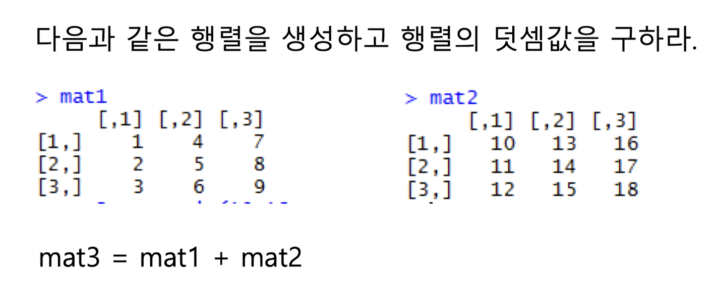
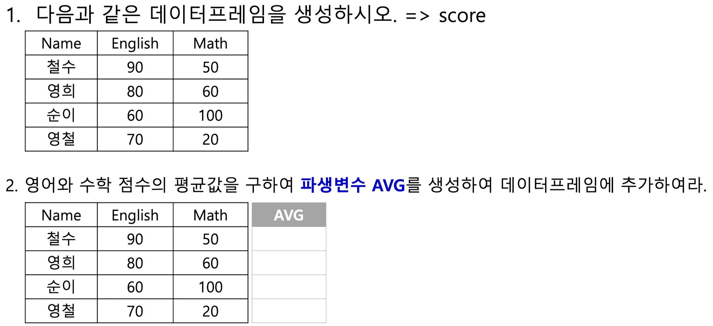

## R 벡터 실습 정리

---
### 목차
- [벡터](#벡터-생성-및-출력)
- [행렬 생성 및 연산](#행렬-생성-및-연산)
- [데이터프레임](#데이터프레임)
- [Factor](#Factor)
- [List](#List)
--- 
- ## 벡터
### 벡터 생성 및 출력

```r
v1 <- c(1,2,3,4)
v1
# 출력: 1 2 3 4  (v1은 1부터 4까지의 정수로 구성된 벡터임)
```

```r
v2 <- -5:5
v2
# 출력: -5 -4 -3 -2 -1 0 1 2 3 4 5  (v2는 -5에서 5까지의 정수로 구성된 벡터임)
```

```r
v3 <- seq(from=0, to=5, by=0.5)
v3
# 출력: 0.0 0.5 1.0 1.5 ... 5.0  (v3는 0에서 5까지 0.5 간격으로 생성된 숫자 벡터임)
```

```r
v4 <- rnorm(20)
v4
# 출력: 평균 0, 표준편차 1인 정규분포 기반 20개 난수  (v4는 정규분포를 따르는 20개의 난수로 구성된 벡터임)
```

### 기본 통계 및 정렬

```r
mean(v1)                # 출력: 2.5  (mean은 벡터의 평균값을 계산함)
order(v2)               # 출력: 1 2 3 4 5 6 7 8 9 10 11  (order는 정렬을 위한 인덱스를 반환함, 오름차순 기준)
rev(v3)                 # 출력: 5.0 4.5 4.0 ... 0.0  (rev는 벡터를 뒤집어서 역순으로 반환함)
range(v1)               # 출력: 1 4  (range는 벡터의 최소값과 최대값을 반환함)
sd(v2)                  # 출력: 2.872281  (sd는 벡터의 표준편차를 계산함)
sort(v4)                # 출력: 오름차순 정렬된 v4의 값들  (sort는 벡터를 오름차순으로 정렬함)
sort(v4, decreasing=TRUE)  # 출력: 내림차순 정렬된 v4의 값들  (decreasing=TRUE는 벡터를 내림차순으로 정렬함)
length(v4)              # 출력: 20  (length는 벡터의 길이, 즉 원소의 개수를 반환함)
```

### 벡터 조작

```r
x <- c(1,4,6,8,9)
x[2]                    # 출력: 4  (인덱스 2의 원소를 반환함)
x[-2]                   # 출력: 1 6 8 9  (인덱스 2의 원소를 제외한 나머지 원소를 반환함)
x[2 < x & x < 5]        # 출력: 4  (조건을 만족하는 원소를 반환함)
replace(x, c(2,4), c(32,24))  # 출력: 1 32 6 24 9  (지정된 인덱스의 원소를 새로운 값으로 교체함)
append(x, y)            # x와 y를 이어붙이기  (x 벡터의 뒤에 y 벡터를 추가함)
append(x, y, after=2)   # 출력: 1 4 "y의 원소들" 6 8 9  (x의 2번째 이후에 y를 삽입함)
```

### 벡터 연산

```r
c(1,2) + c(4,5)         # 출력: 5 7  (두 벡터의 요소별 덧셈을 수행함)
c(1,2,3) + 1            # 출력: 2 3 4  (각 원소에 1을 더한 결과를 반환함)
```

### 집합 연산

```r
x <- c(1,2,3)
y <- c(3,5,6)

x == y                  # 출력: FALSE FALSE TRUE  (각 원소 비교 결과를 반환함)
union(x, y)             # 출력: 1 2 3 5 6  (중복 제거한 x와 y의 합집합을 반환함)
intersect(x, y)         # 출력: 3  (x와 y의 교집합을 반환함)
setdiff(x, y)           # 출력: 1 2  (x에서 y에 없는 원소를 반환함)
setequal(x, y)          # 출력: FALSE  (x와 y가 동일한 원소를 가지는지 확인함)
is.element(3, x)        # 출력: TRUE  (3이 x 벡터의 원소인지 확인함)
```

### 반복과 고유값

```r
x <- rep(c("a","b","c"), times=4)
unique(x)               # 출력: a b c  (중복을 제거한 고유한 원소를 반환함)
match(x, c("a"))        # 출력: 1 NA NA 1 NA NA ...  (x의 각 원소가 c("a")에서의 위치를 반환함)
```

### 문자열 결합

```r
y <- c("d", "e", "f")
paste(x[1], y[3])       # 출력: "a f"  (두 문자열을 결합하여 하나의 문자열로 반환함)
```

### 논리 연산 및 확인

```r
x <- runif(5)
(0.4 <= x) & (x <= 0.7) # 출력: TRUE/FALSE  (x의 각 원소가 0.4 이상 0.7 이하인지 확인함)
any(x > 0.8)            # 출력: TRUE 또는 FALSE  (x의 원소 중 0.8을 초과하는 것이 있는지 확인함)
all(x < 0.7)            # 출력: TRUE 또는 FALSE  (x의 모든 원소가 0.7 미만인지 확인함)
is.vector(x)            # 출력: TRUE  (x가 벡터인지 확인함)
```
---
- ## 행렬
### 행렬 생성 및 연산

```r
# 행렬 생성
row1 = c(1,2,3)
row2 = c(4,5,6)
row3 = c(7,8,9)

# 행 기준으로 결합 (rbind)
mat1 = rbind(row1, row2, row3)
# 출력:
#      [,1] [,2] [,3]
# row1    1    2    3
# row2    4    5    6
# row3    7    8    9

# 열 기준으로 결합 (cbind)
mat2 = cbind(row1, row2, row3)
# 출력:
#      row1 row2 row3
# [1,]    1    4    7
# [2,]    2    5    8
# [3,]    3    6    9

# 열 수 명시 없이 생성 (기본은 열 중심으로 생성됨)
chars = c("a", "b", "c", "d", "e")
mat1 = matrix(chars)
# 출력: 5행 1열

# 열 수를 5로 지정하여 1행 5열로 생성
mat2 = matrix(chars, ncol=5)
mat2
# 출력:
#      [,1] [,2] [,3] [,4] [,5]
# [1,] "a"  "b"  "c"  "d"  "e"

# 숫자 1~8로 2행 행렬 생성 (열 방향으로 채워짐)
mat3 = matrix(1:8, nrow=2)
mat3
# 출력:
#      [,1] [,2] [,3] [,4]
# [1,]    1    3    5    7
# [2,]    2    4    6    8

# 모든 원소에 3 곱하기 (스칼라 곱셈)
mat3 * 3
# 출력:
#      [,1] [,2] [,3] [,4]
# [1,]    3    9   15   21
# [2,]    6   12   18   24

# 행 기준 곱셈 - c(10,20)를 재활용 (1행에 10, 2행에 20 곱함)
mat3 * c(10,20)
# 출력:
#      [,1] [,2] [,3] [,4]
# [1,]   10   30   50   70
# [2,]   40   80  120  160

# 행렬 x 생성 (dimnames으로 행/열 이름 설정)
x = matrix(1:12, nrow=3, dimnames = list(c("R1", "R2", "R3"), c("C1", "C2", "C3", "C4")))
x
# 출력:
#     C1 C2 C3 C4
# R1  1  4  7 10
# R2  2  5  8 11
# R3  3  6  9 12

# 열 기준 인덱스 7번째 값 추출 (1행 3열 → 7)
x[7]
# 출력: 7

# 첫 번째 행, 모든 열 추출
x[1, ]
# 출력: 1 4 7 10

# 모든 행, 2열~4열 추출
x[, 2:4]
# 출력:
#     C2 C3 C4
# R1  4  7 10
# R2  5  8 11
# R3  6  9 12

# 모든 행, 2열만 추출
x[, 2]
# 출력: 
# R1 4
# R2 5
# R3 6

# 행렬을 벡터처럼 다루어 2번째 값 제외 (열 기준 순서)
x[-2]
# 출력: 1 3 4 5 6 7 8 9 10 11 12

```
### 행렬덧셈 실습하기 


````r
# 행렬 덧셈
mat1 = matrix(1:9, nrow=3)
mat2 = matrix(10:18, nrow=3)
mat3 = mat1 + mat2
mat3
# 출력:
#      [,1] [,2] [,3]
# [1,]   11   17   23
# [2,]   13   19   25
# [3,]   15   21   27
````
---
- ## 데이터프레임
> - #### 2차원 형태로 각 칼럼별로 다른 형태의 데이터를 가짐

### 데이터프레임 생성 및 파생변수 추가

```r
# 벡터 네 개 생성
no = c(1,2,3,4)                            # 과일 번호
name = c("Apple", "Banana", "Peach", "Berry") # 과일 이름
prices = c(500,200,200,50)                 # 가격
qty = c(5,2,7,9)                           # 수량

# data.frame 이용해서 표로 만듬
fruit = data.frame(NO = no, Name = name, Prices = prices, QTY = qty)
fruit

# 행 이름 만들기: 기본 지정된 1,2,3,4를 F1, F2, F3, F4로 수정
rownames(fruit) = c("F1", "F2", "F3", "F4")
fruit

# 특정 행 추출
fruit["F1", ]       # 행 이름 기준 추출
fruit[1, ]          # 인덱스 기준 추출

# 특정 컬럼 추출
fruit$Name          # $는 리스트나 데이터프레임에서 특정 '이름이 있는 요소'를 꺼낼 때 쓰는 연산자
fruit$QTY

# 파생변수 생성: 가격 × 수량 = 총가격
fruit$TotalPrice = fruit$Prices * fruit$QTY
fruit
```

### 실습: 점수 데이터프레임 만들기



```r
name = c("철수", "영희", "순이", "영철")
english = c(90, 80, 60, 70)
math = c(50, 60, 100, 20)
score = data.frame(Name = name, English = english, Math = math)
score
score$AVG = (score$English + score$Math) / 2
score
```

### iris 데이터셋과 matrix 변환 실습

```r
dim(iris)                # 데이터의 차원을 알려줌 → 행(Row) 150개, 열(Column) 5개
nrow(iris)               # 행 수
ncol(iris)               # 열 수
colnames(iris)           # 열 이름 반환
class(iris)              # 클래스 확인
str(iris)                # 구조 요약
unique(iris[, 5])        # 5번째 열(Species) 중 중복 제거된 고유 값
unique(iris$Species)     # 동일

colSums(iris[, -5])      # 1~4열의 열별 합계 (Species 제외)
colMeans(iris[, -5])     # 1~4열의 열별 평균
rowSums(iris[, -5])      # 각 행별 합계
rowMeans(iris[, -5])     # 각 행별 평균

is.data.frame(iris)      # 데이터프레임인지 확인
is.matrix(iris)          # 행렬인지 확인

# 데이터프레임을 행렬로 변환 (수치형 열만)
new_iris_mat = as.matrix(iris[, 1:4])
new_iris_mat
class(new_iris_mat)      # "matrix" "array"
```
---

- ## Factor
> - #### 문자형 데이터가 저장되는 벡터의 일종, 저장하는 값들이 어떤 종류를 나타낼 때 사용 (예: 성별, 혈액형)
> - #### 이미 지정된 레벨(level) 이외의 값이 들어오는 것을 막을 수 있음

```r
f = c("A", "B", "B", "O", "AB", "A")

# 문자형 벡터를 Factor로 변환
f_factor = factor(f)
f_factor                     # Levels: A AB B O
levels(f_factor)             # 레벨 확인

f[5]                         # 원래 문자 벡터의 5번째 값
f_factor[5]                  # 팩터의 5번째 값 (level 기준 출력)
f_factor[7]                  # 인덱스 범위 벗어나면 NA 출력

f_factor[7] = "B"            # level에 있는 값 → 삽입 가능
f_factor[8] = "C"            # level에 없는 값 → 경고 + NA

as.integer(f_factor)         # factor 값을 level 번호로 변환
```

----

- ## List
> - #### (키, 값)의 형태로 데이터를 구성

```r

member = list(name = "Lee", address = "seoul", tel = "0108881111", ssn = 010815)
member

member$name                # 이름의 값 꺼내기
member[1:3]                # 리스트의 앞 3개 요소 반환
member$pay = 100           # 새 값 추가 (pay)
member
```
