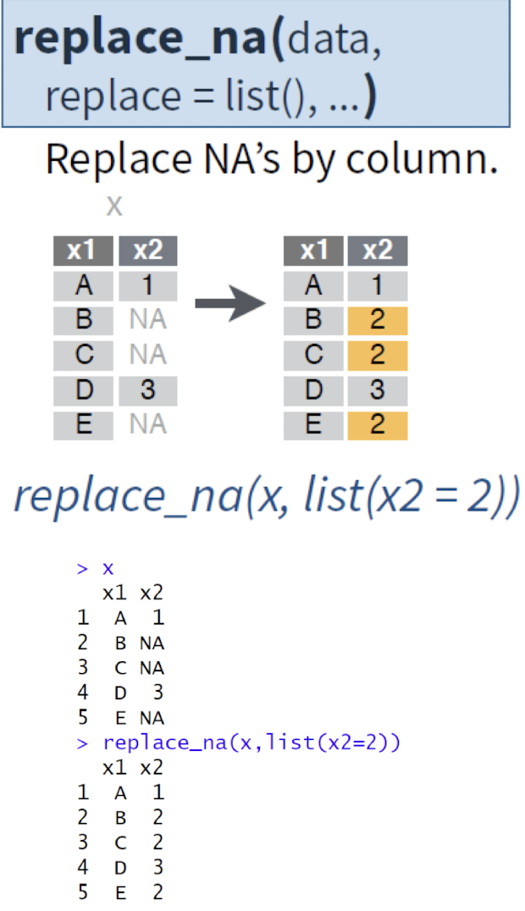

## R 정리


##### 시험전 이거 깔고가기
```r
install.packages("readr")    # read_csv() 사용하려면 필요
install.packages("dplyr")    # 데이터 처리
install.packages("lubridate") # 날짜 처리 (있으면 편함)
# 인코딩 깨질 때
myData = read_csv("파일이름.csv", locale = locale(encoding = "euc-kr"))
```

---
### 목차

- [벡터](#벡터)
  - [벡터 생성 및 출력](#벡터-생성-및-출력)
  - [기본 통계 및 정렬](#기본-통계-및-정렬)
  - [벡터 조작](#벡터-조작)
  - [벡터 연산](#벡터-연산)
  - [집합 연산](#집합-연산)
  - [반복과 고유값](#반복과-고유값)
  - [문자열 결합](#문자열-결합)
  - [논리 연산 및 확인](#논리-연산-및-확인)
- [행렬 생성 및 연산](#행렬-생성-및-연산)
  - [행렬덧셈 실습하기](#행렬덧셈-실습하기)
- [데이터프레임](#데이터프레임)
  - [데이터프레임 생성 및 파생변수 추가](#데이터프레임-생성-및-파생변수-추가)
  - [iris 데이터셋과 matrix 변환 실습](#iris-데이터셋과-matrix-변환-실습)
- [Factor](#factor)
- [List](#list)
- [데이터의 저장 및 불러오기](#데이터의-저장-및-불러오기)
  - [엑셀 데이터 저장 및 불러오기](#엑셀-데이터-저장-및-불러오기)
  - [텍스트파일 저장 및 불러오기](#텍스트파일-저장-및-불러오기)
  - [URL로 데이터 읽기](#url로-데이터-읽기)
- [데이터 조작, 처리 & 가공](#데이터-조작-처리--가공)
  - [1. apply 계열 함수](#1-apply-계열-함수)
  - [2. 데이터를 그룹으로 묶은 후 함수 호출](#2-데이터를-그룹으로-묶은-후-함수-호출)
  - [3. attach & detach](#3-attach--detach)
  - [4. 기타](#4-기타)
- [dplyr package](#dplyr-package)
  - [1. 조건에 맞는 데이터만 추출: filter](#1-조건에-맞는-데이터만-추출-filter)
  - [2. 조건에 맞는 변수만 추출: select](#2-조건에-맞는-변수만-추출-select)
  - [3. 정렬하기: arrange()](#3-정렬하기-arrange)
  - [dplyr 실습 1](#dplyr-실습-1)
  - [4. 파생변수 추가: mutate](#4-파생변수-추가-mutate---여러-변수를-추가하거나-기존-변수를-변경할-수-있게-해줌)
  - [dplyr 실습 2](#dplyr-실습-2)
  - [5. 집단별로 요약하기](#5-집단별로-요약하기)
  - [데이터 가공 실습 1](#데이터-가공-실습-1)
  - [데이터 가공 실습 2(California Test Score 분석)](#데이터-가공-실습-2california-test-score-분석)
  - [6. 합치기](#6-합치기)
  - [데이터 가공: 실습](#데이터-가공-실습)
  - [실습 2: MPG 데이터 분석](#실습-2-mpg-데이터-분석)
- [데이터 정제](#데이터-정제)
  - [1. 결측치 정제 - 제거](#1-결측치-정제---제거)
  - [1. 결측치 정제 - 제외](#1-결측치-정제---제외)
  - [1. 결측치 정제 - 대체](#1-결측치-정제---대체)
  - [2. 이상치 제거](#2-이상치-제거)
- [데이터 정제(tidyr package)](#데이터-정제tidyr-package)
- [Reshaping data in tidyr](#reshaping-data-in-tidyr)
  - [gather](#gather)
  - [spread](#spread)
  - [Handling missing values in tidyr](#handling-missing-values-in-tidyr)
    - [drop_na](#drop_nadata)
    - [fill](#fill)
    - [replace_na](#replace_na)
  - [Expanding table in tidyr](#expanding-table-in-tidyr)
    - [complete](#complete)
    - [expand](#expand)
  - [Splitting cells in tidyr](#splitting-cells-in-tidyr)
    - [separate](#separate)
    - [separate_rows](#separate_rows)
  - [Unite](#uniting-cells-in-tidyr)
--- 

### 설치 할 패키지

 ```r
#tibble
install.packages("tibble")
library("tibble")
#doBy package
install.packages("doBy")
library("doBy")
#dplyr package
install.packages("dplyr")
library("dplyr")
#tidyr package
install.packages("tidyr")
library("tidyr")
#ggplot2
install.packages("ggplot2")
library("ggplot2")
```
---

- ## 벡터
### 벡터 생성 및 출력

```r
v1 <- c(1,2,3,4)
v1
# 출력: 1 2 3 4  (v1은 1부터 4까지의 정수로 구성된 벡터임)
```

```r
v2 <- -5:5
v2
# 출력: -5 -4 -3 -2 -1 0 1 2 3 4 5  (v2는 -5에서 5까지의 정수로 구성된 벡터임)
```

```r
v3 <- seq(from=0, to=5, by=0.5)
v3
# 출력: 0.0 0.5 1.0 1.5 ... 5.0  (v3는 0에서 5까지 0.5 간격으로 생성된 숫자 벡터임)
```

```r
v4 <- rnorm(20)
v4
# 출력: 평균 0, 표준편차 1인 정규분포 기반 20개 난수  (v4는 정규분포를 따르는 20개의 난수로 구성된 벡터임)
```

### 기본 통계 및 정렬

```r
mean(v1)                # 출력: 2.5  (mean은 벡터의 평균값을 계산함)
order(v2)               # 출력: 1 2 3 4 5 6 7 8 9 10 11  (order는 정렬을 위한 인덱스를 반환함, 오름차순 기준)
rev(v3)                 # 출력: 5.0 4.5 4.0 ... 0.0  (rev는 벡터를 뒤집어서 역순으로 반환함)
range(v1)               # 출력: 1 4  (range는 벡터의 최소값과 최대값을 반환함)
sd(v2)                  # 출력: 2.872281  (sd는 벡터의 표준편차를 계산함)
sort(v4)                # 출력: 오름차순 정렬된 v4의 값들  (sort는 벡터를 오름차순으로 정렬함)
sort(v4, decreasing=TRUE)  # 출력: 내림차순 정렬된 v4의 값들  (decreasing=TRUE는 벡터를 내림차순으로 정렬함)
length(v4)              # 출력: 20  (length는 벡터의 길이, 즉 원소의 개수를 반환함)
```

### 벡터 조작

```r
x <- c(1,4,6,8,9)
x[2]                    # 출력: 4  (인덱스 2의 원소를 반환함)
x[-2]                   # 출력: 1 6 8 9  (인덱스 2의 원소를 제외한 나머지 원소를 반환함)
x[2 < x & x < 5]        # 출력: 4  (조건을 만족하는 원소를 반환함)
replace(x, c(2,4), c(32,24))  # 출력: 1 32 6 24 9  (지정된 인덱스의 원소를 새로운 값으로 교체함)
append(x, y)            # x와 y를 이어붙이기  (x 벡터의 뒤에 y 벡터를 추가함)
append(x, y, after=2)   # 출력: 1 4 "y의 원소들" 6 8 9  (x의 2번째 이후에 y를 삽입함)
```

### 벡터 연산

```r
c(1,2) + c(4,5)         # 출력: 5 7  (두 벡터의 요소별 덧셈을 수행함)
c(1,2,3) + 1            # 출력: 2 3 4  (각 원소에 1을 더한 결과를 반환함)
```

### 집합 연산

```r
x <- c(1,2,3)
y <- c(3,5,6)

x == y                  # 출력: FALSE FALSE TRUE  (각 원소 비교 결과를 반환함)
union(x, y)             # 출력: 1 2 3 5 6  (중복 제거한 x와 y의 합집합을 반환함)
intersect(x, y)         # 출력: 3  (x와 y의 교집합을 반환함)
setdiff(x, y)           # 출력: 1 2  (x에서 y에 없는 원소를 반환함)
setequal(x, y)          # 출력: FALSE  (x와 y가 동일한 원소를 가지는지 확인함)
is.element(3, x)        # 출력: TRUE  (3이 x 벡터의 원소인지 확인함)
```

### 반복과 고유값

```r
x <- rep(c("a","b","c"), times=4)
unique(x)               # 출력: a b c  (중복을 제거한 고유한 원소를 반환함)
match(x, c("a"))        # 출력: 1 NA NA 1 NA NA ...  (x의 각 원소가 c("a")에서의 위치를 반환함)
```

### 문자열 결합

```r
y <- c("d", "e", "f")
paste(x[1], y[3])       # 출력: "a f"  (두 문자열을 결합하여 하나의 문자열로 반환함)
```

### 논리 연산 및 확인

```r
x <- runif(5)
(0.4 <= x) & (x <= 0.7) # 출력: TRUE/FALSE  (x의 각 원소가 0.4 이상 0.7 이하인지 확인함)
any(x > 0.8)            # 출력: TRUE 또는 FALSE  (x의 원소 중 0.8을 초과하는 것이 있는지 확인함)
all(x < 0.7)            # 출력: TRUE 또는 FALSE  (x의 모든 원소가 0.7 미만인지 확인함)
is.vector(x)            # 출력: TRUE  (x가 벡터인지 확인함)
```
---
- ## 행렬
### 행렬 생성 및 연산

```r
# 행렬 생성
row1 = c(1,2,3)
row2 = c(4,5,6)
row3 = c(7,8,9)

# 행 기준으로 결합 (rbind)
mat1 = rbind(row1, row2, row3)
# 출력:
#      [,1] [,2] [,3]
# row1    1    2    3
# row2    4    5    6
# row3    7    8    9

# 열 기준으로 결합 (cbind)
mat2 = cbind(row1, row2, row3)
# 출력:
#      row1 row2 row3
# [1,]    1    4    7
# [2,]    2    5    8
# [3,]    3    6    9

# 열 수 명시 없이 생성 (기본은 열 중심으로 생성됨)
chars = c("a", "b", "c", "d", "e")
mat1 = matrix(chars)
# 출력: 5행 1열

# 열 수를 5로 지정하여 1행 5열로 생성
mat2 = matrix(chars, ncol=5)
mat2
# 출력:
#      [,1] [,2] [,3] [,4] [,5]
# [1,] "a"  "b"  "c"  "d"  "e"

# 숫자 1~8로 2행 행렬 생성 (열 방향으로 채워짐)
mat3 = matrix(1:8, nrow=2)
mat3
# 출력:
#      [,1] [,2] [,3] [,4]
# [1,]    1    3    5    7
# [2,]    2    4    6    8

# 모든 원소에 3 곱하기 (스칼라 곱셈)
mat3 * 3
# 출력:
#      [,1] [,2] [,3] [,4]
# [1,]    3    9   15   21
# [2,]    6   12   18   24

# 행 기준 곱셈 - c(10,20)를 재활용 (1행에 10, 2행에 20 곱함)
mat3 * c(10,20)
# 출력:
#      [,1] [,2] [,3] [,4]
# [1,]   10   30   50   70
# [2,]   40   80  120  160

# 행렬 x 생성 (dimnames으로 행/열 이름 설정)
x = matrix(1:12, nrow=3, dimnames = list(c("R1", "R2", "R3"), c("C1", "C2", "C3", "C4")))
x
# 출력:
#     C1 C2 C3 C4
# R1  1  4  7 10
# R2  2  5  8 11
# R3  3  6  9 12

# 열 기준 인덱스 7번째 값 추출 (1행 3열 → 7)
x[7]
# 출력: 7

# 첫 번째 행, 모든 열 추출
x[1, ]
# 출력: 1 4 7 10

# 모든 행, 2열~4열 추출
x[, 2:4]
# 출력:
#     C2 C3 C4
# R1  4  7 10
# R2  5  8 11
# R3  6  9 12

# 모든 행, 2열만 추출
x[, 2]
# 출력: 
# R1 4
# R2 5
# R3 6

# 행렬을 벡터처럼 다루어 2번째 값 제외 (열 기준 순서)
x[-2]
# 출력: 1 3 4 5 6 7 8 9 10 11 12

```
### 행렬덧셈 실습하기


````r
# 행렬 덧셈
mat1 = matrix(1:9, nrow=3)
mat2 = matrix(10:18, nrow=3)
mat3 = mat1 + mat2
mat3
# 출력:
#      [,1] [,2] [,3]
# [1,]   11   17   23
# [2,]   13   19   25
# [3,]   15   21   27
````
---
- ## 데이터프레임
> - #### 2차원 형태로 각 칼럼별로 다른 형태의 데이터를 가짐

### 데이터프레임 생성 및 파생변수 추가

```r
# 벡터 네 개 생성
no = c(1,2,3,4)                            # 과일 번호
name = c("Apple", "Banana", "Peach", "Berry") # 과일 이름
prices = c(500,200,200,50)                 # 가격
qty = c(5,2,7,9)                           # 수량

# data.frame 이용해서 표로 만듬
fruit = data.frame(NO = no, Name = name, Prices = prices, QTY = qty)
fruit

# 행 이름 만들기: 기본 지정된 1,2,3,4를 F1, F2, F3, F4로 수정
rownames(fruit) = c("F1", "F2", "F3", "F4")
fruit

# 특정 행 추출
fruit["F1", ]       # 행 이름 기준 추출
fruit[1, ]          # 인덱스 기준 추출

# 특정 컬럼 추출
fruit$Name          # $는 리스트나 데이터프레임에서 특정 '이름이 있는 요소'를 꺼낼 때 쓰는 연산자
fruit$QTY

# 파생변수 생성: 가격 × 수량 = 총가격
fruit$TotalPrice = fruit$Prices * fruit$QTY
fruit
```

### 실습: 점수 데이터프레임 만들기


```r
name = c("철수", "영희", "순이", "영철")
english = c(90, 80, 60, 70)
math = c(50, 60, 100, 20)
score = data.frame(Name = name, English = english, Math = math)
score
score$AVG = (score$English + score$Math) / 2
score
```

### iris 데이터셋과 matrix 변환 실습

```r
dim(iris)                # 데이터의 차원을 알려줌 → 행(Row) 150개, 열(Column) 5개
nrow(iris)               # 행 수
ncol(iris)               # 열 수
colnames(iris)           # 열 이름 반환
class(iris)              # 클래스 확인
str(iris)                # 구조 요약
unique(iris[, 5])        # 5번째 열(Species) 중 중복 제거된 고유 값
unique(iris$Species)     # 동일

colSums(iris[, -5])      # 1~4열의 열별 합계 (Species 제외)
colMeans(iris[, -5])     # 1~4열의 열별 평균
rowSums(iris[, -5])      # 각 행별 합계
rowMeans(iris[, -5])     # 각 행별 평균

is.data.frame(iris)      # 데이터프레임인지 확인
is.matrix(iris)          # 행렬인지 확인

# 데이터프레임을 행렬로 변환 (수치형 열만)
new_iris_mat = as.matrix(iris[, 1:4])
new_iris_mat
class(new_iris_mat)      # "matrix" "array"
```
---

- ## Factor
> - #### 문자형 데이터가 저장되는 벡터의 일종, 저장하는 값들이 어떤 종류를 나타낼 때 사용 (예: 성별, 혈액형)
> - #### 이미 지정된 레벨(level) 이외의 값이 들어오는 것을 막을 수 있음

```r
f = c("A", "B", "B", "O", "AB", "A")

# 문자형 벡터를 Factor로 변환
f_factor = factor(f)
f_factor                     # Levels: A AB B O
levels(f_factor)             # 레벨 확인

f[5]                         # 원래 문자 벡터의 5번째 값
f_factor[5]                  # 팩터의 5번째 값 (level 기준 출력)
f_factor[7]                  # 인덱스 범위 벗어나면 NA 출력

f_factor[7] = "B"            # level에 있는 값 → 삽입 가능
f_factor[8] = "C"            # level에 없는 값 → 경고 + NA

as.integer(f_factor)         # factor 값을 level 번호로 변환
```


- ## List
> - #### (키, 값)의 형태로 데이터를 구성

```r

member = list(name = "Lee", address = "seoul", tel = "0108881111", ssn = 010815)
member

member$name                # 이름의 값 꺼내기
member[1:3]                # 리스트의 앞 3개 요소 반환
member$pay = 100           # 새 값 추가 (pay)
member
```
---

- ## 데이터의 저장 및 불러오기

```r

# dataframe 생성
no = c(1,2,3,4)
name = c("Apple", "Banana", "Peach", "Berry")
price = c(500,200,300,400)
quantity = c(5,2,7,9)
fruit = data.frame(N0 = no, Name = name, Price = price, Quantity = quantity)
fruit

# 저장하기 (getwd(), setwd()로 경로 지정해주기)
save(fruit, file="test.dat")

# 불러오기
load("test.dat")
fruit
```

### 엑셀 데이터 저장 및 불러오기

```r
# 불러오기
score = read.csv("score.csv")
score

# 저장하기
write.csv(fruit, "fruit.csv")
```

### 텍스트파일 저장 및 불러오기

```r
# txt 불러오기
b = scan("birth.txt", what = "")  # 값만 읽어서 vector로 출력
b

c = read.table("birth.txt", header = T)  # 표 형태의 데이터를 읽어서 데이터프레임으로 출력
c

# 저장하기
vec1 = c(1,2,3)
vec2 = c(4,5,6)
mat = rbind(vec1, vec2)
mat
save(mat, file="testmat.txt")

dfile = load("testmat.txt")
dfile
mat
```

### URL로 데이터 읽기

```r
url = "https://vincentarelbundock.github.io/Rdatasets/csv/AER/CASchools.csv"
myCASchools = read.csv(url)
str(myCASchools)
myCASchools

# as_tibble 사용 시 보기 편하게 출력 (library(tibble) 필요)
myTCASchools = as_tibble(myCASchools)
myTCASchools
```
---

- ## 데이터 조작, 처리 & 가공
> - 벡터, 행렬, 데이터 프레임에 임의의 함수를 적용한 결과를 얻기 위한 함수
> - 데이터 전체에 대해 함수를 한번에 적용하는 연산 수행을 통해 데이터 조작, 처리

### [1] apply 계열 함수

- apply(X, MARGIN, FUN)
> - X: 배열
> - MARGIN: 함수를 적용하는 방향(1: 행, 2: 열, c(1,2) 행, 열 모두)
> - FUN: 적용할 함수

```r
head(iris)  # iris 데이터의 앞부분을 미리 확인

# apply(X, MARGIN, FUN)
apply(iris[,1:4], 2, sum)  # 모든 행의 1~4열 데이터에 대해 열 기준(2)으로 sum 적용

# lapply(X, FUN) X: 배열, 리스트, 표현식
x = list(a = 1:3, c = 4:6)
lapply(x, mean)  # 리스트의 각 요소에 평균 함수(mean)를 적용

# sapply(X, FUN) X: 배열, 리스트 | FUN: 적용할 함수
sapply(iris[,1:4], mean)  # 데이터프레임의 각 열마다 평균을 구해 벡터로 반환
x = sapply(iris[,1:4], mean)
as.data.frame(x)  # 결과를 데이터프레임으로 변환

# tapply(X, INDEX, FUN) X: 배열, 리스트, 표현식 | FUN: 적용할 함수
tapply(iris$Sepal.Length, iris$Species, mean)  # Sepal.Length를 Species 기준으로 그룹화 후 평균 계산

# mapply(FUN, ...)
mapply(rnorm, c(1,2,3), c(0,10,100), c(1,1,1))  # rnorm을 여러 파라미터 조합으로 반복 적용
```

### [2] 데이터를 그룹으로 묶은 후 함수 호출

```r
summary(iris)  # 데이터 요약 정보 제공

# summaryBy: 데이터프레임을 컬럼 값에 따라 그룹으로 묶은 후 요약 값 계산
summaryBy(Sepal.Width + Sepal.Length ~ Species, iris)  # Species 기준으로 Sepal.Width와 Sepal.Length 평균, 합 등 요약

# orderBy: 지정한 칼럼값에 따라 데이터 프레임을 정렬
order(iris$Sepal.Width)  # Sepal.Width 기준 오름차순이 되기 위한 인덱스 정렬
orderBy(~Sepal.Width, iris)  # Sepal.Width 기준으로 오름차순 정렬된 데이터프레임 반환

# sampleBy: 데이터프레임을 컬럼 값에 따라 그룹으로 묶은 후 sample 추출
sampleBy(~Species, frac=0.1, data=iris)  # Species별로 10%씩 샘플 추출

# split: 주어진 조건에 따라 데이터를 분리한다
split(iris, iris$Species)  # Species 기준으로 데이터프레임을 리스트로 분리

# subset: 주어진 조건을 만족하는 조건을 선택한다
subset(iris, Species == "setosa")  # setosa 종만 추출
subset(iris, Sepal.Length > 5.0 & Sepal.Width > 4.0)  # 길이 > 5, 넓이 > 4인 행만 추출
subset(iris, Sepal.Length > 5.0 & Sepal.Width > 4.0, select = c('Species'))  # 조건을 만족하는 행의 Species 열만 출력
subset(iris, Sepal.Length > 5.0 & Sepal.Width > 4.0, select = c('Petal.Length', 'Petal.Width'))  # 특정 열만 선택 출력

# merge: 데이터를 공통된 값에 기준해 병합
x = data.frame(name=c("a","b","c"), math=c(1,2,3))
y = data.frame(name=c("c","b","a"), english=c(4,5,6))
merge(x, y)  # 공통 컬럼 name 기준으로 병합

# with & within
with(iris, {
  print(mean(Sepal.Length))  # Sepal.Length 평균 출력
  print(mean(Sepal.Width))   # Sepal.Width 평균 출력
})

x = data.frame(val = c(1,2,3,4,NA,5,NA))
x = within(x, {
  val = ifelse(is.na(val), median(val, na.rm=TRUE), val)  # NA 값이면 중앙값으로 대체
})
```

### [3] attach & detach

```r
attach(iris)  # iris 데이터프레임의 컬럼을 직접 접근 가능하게 함
head(Sepal.Width)  # Sepal.Width 바로 접근
detach(iris)  # iris 해제
head(Sepal.Width)  # 에러 발생 (iris 해제됨)
```

### [4] 기타

```r
# which
which_test <- which(iris$Sepal.Length > 7)  # Sepal.Length > 7인 인덱스 반환
iris[which_test, ]  # 해당 조건을 만족하는 행 추출

# order
x <- c(3,1,4,1,5,9,2)
sorted_index <- order(x)  # 오름차순 인덱스 반환
sorted_x <- x[sorted_index]  # 정렬된 벡터 생성
sorted_x_desc <- x[order(x, decreasing = TRUE)]  # 내림차순 정렬

# aggregate
df <- data.frame(group = c("A","B","A","B","A","B"), value = c(10,20,15,25,12,30))
agg_result <- aggregate(value ~ group, data = df, FUN = mean)  # 그룹별 평균
agg_sum <- aggregate(value ~ group, data = df, FUN = sum)  # 그룹별 합계
print(agg_result)
print(agg_sum)
```

---

- ## dplyr package
> - #####  데이터 전처리: 분석에 적합하게 데이터를 가공하는 작업
> - ##### 일부 추출, 종류별로 나누기, 여러 데이터 합치기 등의 작업 수행


### 1. 조건에 맞는 데이터만 추출: filter
- object_name %>% filter(조건식)
```r
exam %>% filter(class == 1)
# → class가 1인 행만 추출됨
```


### 2. 조건에 맞는 변수만 추출: select
- object_name %>% select
```r
exam %>% select(class, english)
# → class와 english 컬럼만 추출됨
```


### 3. 정렬하기: arrange()


```r
# Math 성적에 따른 오름차순 정렬
exam %>% arrange(math)

# Math 성적에 따른 내림차순 정렬
exam %>% arrange(class, desc(math))
# → class를 기준으로 먼저 정렬하고, 같은 class 내에서는 math 점수 기준 내림차순 정렬
```
---
- ## dplyr 실습 1


-  Q1. 각 county 별로 전체 인구 대비 아시아 인구 백분율을 구하고, 
그 값이 Midwest 지역의 평균을 초과할 경우는 "large",
그 외에는 "small"로 분류하여 "large"와 "small"에 해당하는 지역이 각각 얼마나 되는지 확인 하여라

```r
### 백분율 구하기
midwest$ratio = midwest$popasian / midwest$poptotal
x = mean(midwest$ratio)
midwest$grade = ifelse(midwest$ratio >= x, "large", "small")
table(midwest$grade)
# → "large", "small" 개수 확인
qplot(midwest$grade)
# → 막대그래프 출력 (library(ggplot2) 필요)
```


- Q2. 아시아 인구 백분율이 가장 높은 상위 10개 county(지역)의 아시아 인구 백분율을 출력하시오.

```r
midwest_new = midwest %>%
  arrange(desc(ratio)) %>%   # midwest$ratio 대신 ratio만 사용해도 동일
  select(county, ratio) %>%
  head(10)
# → 상위 10개 지역의 county명과 백분율 확인
```


- Q3. 아시아 인구 백분율이 가장 높은 순으로 정렬하여 county와 아시아 인구 백분율을 asiapop.csv파일로 생성하시오.
```r
write.csv(midwest_new, "asiapop.csv")
# → 현재 작업 폴더에 asiapop.csv 파일 저장됨
```


### 4. 파생변수 추가: mutate -> 여러 변수를 추가하거나 기존 변수를 변경할 수 있게 해줌

```r
exam = read.csv("exam.csv")
exam %>% mutate(
  total = math + english + science,                   # 총점 계산
  mean = (math + english + science)/3,                # 평균 계산
  test = ifelse(mean >= 60, "pass", "fail")           # 60점 이상이면 pass
) %>% arrange(desc(total))                            # 총점 기준 내림차순 정렬
# mutate() -> 변수 추가, arrange(desc(total))는 내림차순 정렬임
```
---
- ## dplyr 실습 2


```r
# url로 csv 열기
url=("https://vincentarelbundock.github.io/Rdatasets/csv/AER/CASchools.csv")
myCASchools=read.csv(url)

# 2. 각 학교의 read + math 평균 계산하여 새로운 변수 mymean 생성
myCASchools$mymean <- (myCASchools$read + myCASchools$math) / 2

# 3. 전체 평균 구하기, California 전체 학교의 평균 점수 평균값(CA_mean) 계산
CA_mean <- mean(myCASchools$mymean)

# 4. 평균보다 높은 상위 10개 학교의 위치(county), 이름(school), 학교 read + math test 평균을 알아내시오
myCASchools %>% 
  filter(mymean>CA_mean) %>% # 평균보다 높은 학교만 필터링
  arrange(desc(mymean)) %>% # 평균 점수 기준으로 내림차순 정렬
  select(county, school, mymean) %>% # 필요한 열만 추출
  head(10) # 상위 10개 학교 출력
```
---
### 5. 집단별로 요약하기
- group_by: 데이터를 그룹별로 나누기만 함, 평균, 합계 등을 계산하진 않음
- summarise(): 그룹별 요약 통계를 계산함
```r
x = read.csv("exam.csv")

# group으로만 묶기: 같은 group데이터가 보이지 않는 특별한 객체로 나누어짐
x %>% group_by(class)

# group로 묶고 반별 science 평균 점수를 계산해서 새로운 데이터 프레임 반환
x %>% group_by(class) %>%
summarise(mean = mean(science))
```
---

- ## 데이터 가공 실습 1
> 반별로 수학 성적 요약하기: 평균, 합계, 중앙값, 학생 수
> ```r
> x %>% group_by(class) %>%
> summarise(
> math_mean = mean(math),       # 평균 구하기
> math_total = sum(math),       # 합계 구하기
> math_median = median(math),   # 중앙값 구하기
> n = n()                       # 학생 수 구하기, n(): 현재 그룹의 행 개수 계산
> )
>```
---

- ## 데이터 가공 실습 2(California Test Score 분석)
> - County별 학생수를 구하고, 학생수가 많은 county 5개를 알아내어라
> ```r
> url = ("https://vincentarelbundock.github.io/Rdatasets/csv/AER/CASchools.csv")
> myCASchools = read.csv(url)
> myCASchools
> myCASchools %>% group_by(county) %>% # county로 그룹
> summarise(TS = sum(students)) %>% # 각 county마다 학생수를 더한 후 TS에 저장(dataframe에는 추가 X)
> arrange(desc(TS)) %>% # 학생수가 많은 순서로 내림차순 정렬(그룹들끼리비교하기)
> head(5) # 상위 5개 county만 보이도록
> ```

> - County별 TPS(선생님 당 학생수)를 구하고, TPS가 큰 county 5개를 알아내어라
> ```r
> myCASchools %>% 
>  group_by(county) %>% # county로 그룹 만들기
>  summarise(TPS = (sum(students)/sum(teachers))) %>% # county - TPS로 새로운 값 생성
>  arrange(desc(TPS)) %>% # TPS 내림차순으로 정렬하기
>  head(5) #위에 5개 보여주기
>```
---
### 6. 합치기
- 가로로 합치기: left_join(data1, data2, by="기준변수명") -> 열이 늘어남
```r
test1 = data.frame(id = c(1,2,3,4,5), midterm = c(60,80,70,90,85))
test2 = data.frame(id = c(1,2,3,4,5), final = c(70,83,65,95,80))
total=left_join(test1,test2,by="id")
total
```
---

- ## 데이터 가공: 실습
- 가로로 합치기: exam + 담임선생님

```r
name = data.frame(class=c(1,2,3,4,5), teacher=c("kim", "lee", "park", "choi", "jung"))
exam_new = left_join(exam, name, by="class")
exam_new
# 세로로 합치기: bind_rows(data1, data2) -> 행이 늘어남(단, 변수명이 같아야 합칠 수 있음)
group_a = data.frame(id=c(1,2,3,4,5), test=c(60,80,70,90,85))
group_b = data.frame(id=c(6,7,8,9,10), test=c(70,83,65,95,80))
group_all = bind_rows(group_a, group_b)
group_all
# 변수명이 다를때는 rename을 이용하여 변수명을 동일하게 맞춘 후 합쳐야 함
# group_b = rename(group_b, id=id2) -> rename(데이터프레임, 새이름 = 기존이름)
```
---

- ## 실습 2: MPG 데이터 분석
> - Q1: class가 "suv"인 자동차와 "compact"인 자동차 중 어떤 자동차의 평균 도시연비(cty)가 더 높은지 알아보시오.
>```r
> df=mpg %>% select(class, cty) # class(차종), cty(도심연비) 열만 추출
> df_suv = df %>% filter(class=="suv")  # class가 suv인 데이터만 추출
> df_compact = df %>% filter(class == "compact") # class가 compact인 데이터만 추출
> mean(df_suv$cty) # suv의 평균 도시 연비 계산
> mean(df_compact$cty) # compact의 평균 도시 연비 계산
> ```

> - Q2: "audi"에서 생산한 자동차 중에서 고속도로연비(hwy)가 1~5위에 해당하는 자동차의 데이터를 출력하시오.
> ```r
> mpg %>%
> filter(manufacturer=="audi") %>% # 제조사가 audi인 자동차만 필터링# 제조사가 audi인 자동차만 필터링
> arrange(desc(hwy)) %>% # 고속도로 연비(hwy) 기준 내림차순 정렬
> head(5) # 상위 5개 자동차 데이터 출력
> ```

> - Q3: 어떤회사에서 'compact'(경차) 차종을 가장 많이 생산하는지 분석하시오
> ```r
> mpg %>%
> select(manufacturer, class) %>% # compact 차종만 필터링
> group_by(manufacturer) %>% # 제조사별로 그룹화
> summarise(num=n()) %>% # compact 차종 수를 계산
> arrange(desc(num)) # 개수 기준으로 내림차순 정렬
> ```

> - Q4: 각 회사별(manufacturer)로 구동방식(drv: 4, f, r)에 따라 도시 연비가 어떻게 다른지 분석하시오
> ```r
> mpg %>%
> group_by(manufacturer, drv) %>% # 제조사와 구동방식별로 그룹화
> summarise(mean_cty=mean(cty)) %>% # 각 그룹별 평균 도시 연비 계산
> head(10) # 상위 10개 결과 출력
> ```
---
- ## 데이터 정제
- 결측치 및 이상치 제거
- 결측치: 누락된 값, 비어있는 값
- R에서는 NA로 표시됨
- R의 결측치 확인 함수: in.na()

```r
df=data.frame(gender=c("M", "F", NA, "M", "F"), score = c(5,4,3,4,NA))
is.na(df)
table(is.na(df)) # 카테고리형 데이터의 빈도수(개수)를 세주는 함수
```
---

- ### (1) 결측치 정제 - 제거
- 결측치가 있는 행만 추출하여 제거: filter
- 여러변수에 동시에 결측치가 없는 데이터만 추출(결측치가 하나라도 있으면 제거): na.omit()

```r
table(is.na(df$gender)) # NA가 아닌 값 4개, NA인 값이 1개
table(is.na(df$score)) # NA가 아닌값 4개, NA인 값이 1개
mean(df$score) #결측값이 하나라도 있으면 NA 출력

df_nomiss=df %>% filter(!is.na(score)) # NA가 있던 행 제거, score에 na 있는 행 제거, ! 붙여야 NA인 값이 FALSE로 출력
df_nomiss
mean(df_nomiss$score) # 4 출력
df_nomiss = df %>% filter(!is.na(score)&!is.na(gender)) #!
df_nomiss
```

- ### (1) 결측치 정제 - 제외
- 함수의 결측치 제외 기능 이용하기: na.rm = T

```r
mean(df$score, na.rm=T) #결측치 제거하고 평균 산출
sum(df$score, na.rm = T) #결측치 제거하고 합계 산출
df %>% summarise(mean_score=(mean(score, na.rm = T))) # score의 결측치를 제거하고 평균값만 추출하기
```


- ### (1) 결측치 정제 - 대체
- 데이터가 작고 결측치가 많은 경우 사용
- 결측치를 제거하는 대신 다른값을 채워넣는 방법
- 평균, 최빈값으로 일괄 대체
- 통계 분석 기법으로 각 결측치의 예측값을 추정해 대체

```r
df$score
# 결측치를 평균값으로 대체
df$score = ifelse(is.na(df$score), mean(df$score, na.rm = T), df$score)
df$score
```

- ### (2) 이상치 제거
- 이상치(Outlier): 정상 범주에서 크게 벗어난 값
- 제거순서 
  - (1) 결측치(na)로 변환
  - (2) 분석에서 제외

```r
outlier=data.frame(gender= c(1,2,1,3,2,1), score=c(5,4,3,4,2,600))
outlier
table(outlier$gender) # table: 값이 몇번 나왔는지 알 수 있음
table(outlier$score)

outlier$gender=ifelse(outlier$gender == 3, NA, outlier$gender)
outlier$score=ifelse(outlier$score >5, NA, outlier$score)
outlier
mean(outlier$gender)
mean(outlier$score)


outlier %>% filter(!is.na(gender)&!is.na(score)) %>% #NA가 있는 행을 제거, NA가 아닌 값만 남김, & -> 둘다 NA가 아니어야 통과
group_by(gender) %>% #gender를 기준으로 그룹 나눔
summarise(mean_score=mean(score)) #값들을 평균 냄
```
---

- ## 데이터 정제(tidyr package)

> ### Tidy Data란?
> - Tidy data는 분석하기 좋은 데이터 형태

> <Tidy Data의 3가지 원칙>
> - 각 변수(variable)는 열(column)
> 
> >예: 성별, 나이, 점수 → 각각 따로 열
> - 각 관측값(observation, case)은 행(row)
> 
> >예: 한 사람의 성별/나이/점수 → 한 줄
> 
> 3. 각 셀(cell)은 하나의 값만 가짐
> > 예: “남/20/80점”이 한 셀에 있으면 안 되고, “남”, “20”, “80”이 따로 있어야 tidy함
---

- ## Reshaping data in tidyr
(change the layout of values in a table)

- ## gather
```r
gather(data, key, value, ...): wide -> long변환
# 여러개의 열을 두열(key,value, ...)로 모음 
```


```r
gather(table4a, '1999', '2000', key="year", value="cases")
```
- key = "year" → 열 이름(1999, 2000)을 이 year 열로 옮김
- value = "cases" → 실제 값(0.7K, 2K 등)을 이 cases 열에 넣음

- ## spread
```r
spread(data, key, value): long -> wide변환
# key 열의 고유값을 새로운 열 이름으로 펼치고, value 열 값을 각 셀에 채워 넣음
spread(data, key = "열로 펼칠 기준", value = "셀에 들어갈 값")
```


```r
spread(table2, type, count)
```
- type: type열의 값들(cases, pop)이 새로운 열 이름이 됨
- count 값이 각각의 셀에 들어감
---

- ## Handling missing values in tidyr

- ## drop_na(data)

```r
drop_na(data, ...): NA가 포함된 행 제거
# 지정한 열에 NA가 있는 행을 삭제함
```


```r
x = data.frame(x1 = c("A", "B", "C", "D", "E"), x2 = c(1, NA, NA, 3, NA))
drop_na(x, x2)
```
- x2열에 NA가 있는 행은 모두 제거됨
- 결과는 NA 없는 깔끔한 행만 남음

- ## fill

```r
fill(data, ..., .direction = c("down", "up"))
# NA를 바로 위(또는 아래)의 값으로 채움
# 엑셀에서 '채우기' 기능과 유사
```


```r
fill(x,x2)
```
- x2열에서 NA가 있으면 이전 값으로 채워짐
- 기본 방향은 "down" (위에서 아래)

- ## replace_na

```r
replace_na(data, replace = list(col = value))
# NA를 원하는 값으로 직접 대체함
```


```r
replace_na(x, list(x2 = 2))
```
- x2 열에서 모든 NA를 2로 대체
- 열마다 다른 값 지정 가능(list 형태로 전달)
---

- ## Expanding table in tidyr
- ## Complete

```r
complete(data, ..., fill = list())
```
- 기존 데이터에 빠진 조합을 채워서 모든 가능한 조합을 완성해줌
- 실제 값이 없으면 NA로 채워짐 -> "데이터에 있어야 할 값인데 빠졌을 경우"에 유용

```r
df=tibble(
        year = c(2010, 2010, 2010, 2010, 2012, 2012, 2012),
        qtr = c(1,2,3,4,1,2,3),
        revenue = c(10,20,30,40,NA,60,70)
)
df # 2011년도 없음, 2012의 4분기(qtr=4)도 없음
df %>% complete(year=full_seq(year,1), qtr)
```
- year = full_seq(year,1) -> year를 1년 단위로 순서대로 채워라, 즉 2011을 만들라는 뜻
- qtr -> 각 연도마다 qtr= 1~4를 전부 채움
- 다음과 같은 표가 만들어짐

  | year | qtr | revenue |
  |------|-----|---------|
  | 2010 | 1   | 10      |
  | 2010 | 2   | 20      |
  | 2010 | 3   | 30      |
  | 2010 | 4   | 40      |
  | 2011 | 1   | NA      |
  | 2011 | 2   | NA      |
  | 2011 | 3   | NA      |
  | 2011 | 4   | NA      |
  | 2012 | 1   | NA      |
  | 2012 | 2   | 60      |
  | 2012 | 3   | 70      |
  | 2012 | 4   | NA      |


- ## expand
```r
expand(data, ...)
```
- 주어진 변수들의 모든 가능한 조합을 생성함
- 값을 채워지지 않고, NA가 생기는게 아닌 아예 값 없이 조합만 나옴

```r
df %>% expand(year = full_seq(year, 1), qtr)
```
- 행은 2010 ~ 2012, 열은 1~4까지 생성
- 밑의 표처럼 가능한 모든 경우의 수의 표가 생성됨

| year | qtr |
  |------|-----|
  | 2010 | 1   |
  | 2010 | 2   |
  | 2010 | 3   |
  | 2010 | 4   |
  | 2011 | 1   |
  | 2011 | 2   |
  | 2011 | 3   |
  | 2011 | 4   |
  | 2012 | 1   |
  | 2012 | 2   |
  | 2012 | 3   |
  | 2012 | 4   |

```r
df <- tibble(
        year = c(2010, 2010, 2012),
        qtr = c(1, 2, 3),
        revenue = c(10, NA, 30)
)

df %>% expand(year, qtr, revenue)
```
- 이 코드 실행 시 값의 목록은 다음과 같다
  - year:2010, 2012
  - qtr: 1,2,3
  - revenue: 10, NA, 30
즉, 2(year) * 3(qtr) * 3(revenue) = 18개 조합 생성

- 다음과 같은 표가 그려짐

| year | qtr | revenue |
  |------|-----|---------|
  | 2010 | 1   | 10      |
  | 2010 | 1   | NA      |
  | 2010 | 1   | 30      |
  | 2010 | 2   | 10      |
  | 2010 | 2   | NA      |
  | 2010 | 2   | 30      |
  | 2010 | 3   | 10      |
  | 2010 | 3   | NA      |
  | 2010 | 3   | 30      |
  | 2012 | 1   | 10      |
  | 2012 | 1   | NA      |
  | 2012 | 1   | 30      |
  | 2012 | 2   | 10      |
  | 2012 | 2   | NA      |
  | 2012 | 2   | 30      |
  | 2012 | 3   | 10      |
  | 2012 | 3   | NA      |
  | 2012 | 3   | 30      |

---

- ## Splitting cells in tidyr

- ## separate
```r
separate(data, col, into, sep = "/", remove = TRUE, convert = FALSE, extra="warn", fill="warn", ...)
# 하나의 셀 값을 구분자로 나눠서 여러 열로 나눔
```
- 한셀에 "값1/값2" 형태로 들어있는 데이터를 두 열로 나누고 싶을 때 사용


```r
separate(table3, rate, into = c("cases", "pop"), sep = "/")
```
- rate 열의 0.7K/19M 같은 값을 -> "cases" = 0.7K, "pop" = 19M 으로 나눔

- ## separate_rows()
```r
separate_rows(data, col, sep = "/")
# 한 셀에 들어있는 여러 값을 아아행으로 나눠줌
```
- "값1/값2" 처럼 하나의 셀에 여러 개의 값이 있을 때 한 행을 여러행으로 늘려서 각각의 값을 따로 표현


```r
separate_rows(table3, rate, sep = "/")
```
- "0.7K/19M" -> 한 행이 아닌 두 행: 하나는 "0.7K", 하나는 "19M" 으로 나눠줌

- separate(), separate_rows() 비교 요약

  | 함수              | 결과 형태 | 사용 목적                          |
  |-------------------|------------|-------------------------------------|
  | `separate()`       | 열 분리     | 셀 안의 값을 **여러 열로 나눔**        |
  | `separate_rows()`  | 행 분리     | 셀 안의 값을 **여러 행으로 나눔**        |

---
- ## Uniting cells in tidyr
```r
unite(data, col, ..., sep = "_", remove = TRUE)
# 여러 열을 하나의 열로 합침
col: 인자이름이 아닌, 위치인자(parameter position), 즉 새로 만들 열 이름이 들어와야 한다라는 뜻
```
- 여러 열의 값을 하나로 합쳐서 -> 한 열로 병합


```r
unite(table5, year, century, year, sep = "")
```

- century와 year 열을 합쳐서 새로운 "year" 열을 만듦
- sep = "" -> 공백 없이 그대로 붙이기 (19 + 99 -> 1999)
- 공백 넣고 싶으면 sep = " " 사용하기


- unite 문법 잡고 가기
```r
unite(table5, century, year, col="year", sep="")
```
해도 year이라는 새로운 열로 century, year가 합쳐짐, col = "year"을 지정해주었기 때문처럼 보이지만...

**사실은 R이 col = "year"를 문자열로 내부 처리했을 뿐, 공식 문법은 아님**


정확한 문법은 

```r
unite(data, col, ..., sep = "",)
```
이 된다. col: 새로운 열, 그다음 합칠 열, 간격.. 이런식으로 써야 함
```r
unite(data, 새로운 열, 합칠 열1, 합칠 열2, ... 간격)
```

## 과제
- ### 과제 1
> 
>
> 1. 다음과 같은 데이터 프레임 burger를 생성하시오
> ```r
> brand <- c("M", "L", "B")
> menu <- c("빅맥", "불고기버거", "치즈와퍼")
> kcal <- c(514, 533, 566)
> na <- c(917, 817, 920)
> fat <- c(15, 13, 12)
> 
> burger <- data.frame(
> 브랜드 = brand,
> 메뉴명 = menu,
> 열량 = kcal,
> 나트륨 = na,
> 포화지방 = fat
> )
> 
> rownames(burger) = c("M","L","B")
> colnames(burger) <- c("브랜드(brand)", "메뉴명(Menu)", "열량(Kcal)", "나트륨(Na)", "포화지방(Fat)")
> ```
> 2. 다음 질문에 답하는 코드를 작성하시오.
> 
> > (1) M사의 나트륨 함량은?
>> ```r
>> burger[1,4]
>> ```
>
>> (2) 모든 브랜드의 열량 정보는?
>>  ```r
>> burger[,3]
>> ```
>> (3) M과 B사의 menu명은?
>> ```r
>> burger[burger$`브랜드(brand)` %in% c("M", "B"), '메뉴명(Menu)']
>> burger[c('M','B'), '메뉴명(Menu)'] #M, B 행, '메뉴명(Menu)'열 추출
>>```

- ### 과제 2
